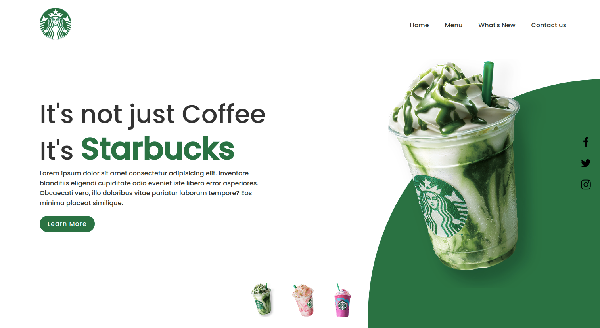

# starbucks-interface
Creation of a starbucks interface using html and css, project under construction !!!!

<h3>Final result:</h3>

 
 

## Tasks performed:

- [x] creation HTML

- [x] Stylization CSS

- [ ] Responsiveness

<h4>click here to see the application working <a href="https://izabela-guimaraes.github.io/Starbucks-interface/" target="blank">click here</a></h4>

 

<h4>to see another project <a href="https://github.com/izabela-guimaraes/PlayStation-Store" target="blank">click here</a></h4>

🚀 Technologies

This project was developed with the following technologies:
 

-html
 
-css
 

## 🤝  Contributors

We thank the following people who contributed to this project:

<table>
  <tr>
    <td align="center">
      <a href="#">
         
        
          <b>Izabela Guimarães</b>
        
      </a>
    </td>
</table>

 

